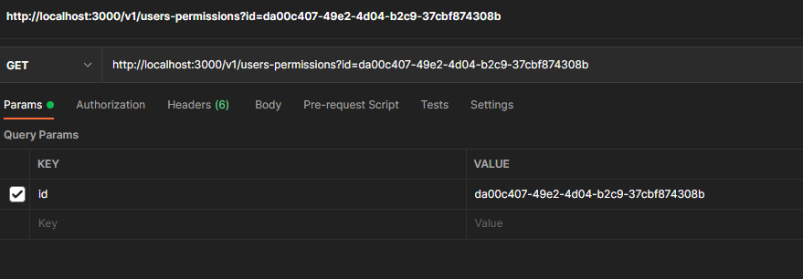

# Introduction

This part concerns testing lambdas locally with a focus on lambdas that interact with a deployed DynamoDB table. Please follow the steps below, that explain a successfull testing of ListUsersPermissions lambda:

## Pre-requisites

Before starting, ensure you have followed step by step the guide in [local-testing-setup](./local-testing-setup.md), especially the part regarding the installation of [AWS SAM CLI](https://docs.aws.amazon.com/serverless-application-model/latest/developerguide/sam-specification.html 'SAM Docs').

# Add lambda's env variables to local.json

You first need to add the name of your lambda and the corresponding variable names it's using (table name in our case) to src/local.json. For our example:

```
{
    "ListUsersPermissions": {
        "USERS_PERMISSIONS_TABLE_NAME": "users-permissions-dev"
    }
}
```

Please make sure you are up to date with the main branch, because this file was already created.

For more information please see this [local.json doc](https://docs.aws.amazon.com/serverless-application-model/latest/developerguide/serverless-sam-cli-using-invoke.html#serverless-sam-cli-using-invoke-environment-file)

# Local Test - ListUsersPermissions Lambda

In package.json you'll find a script named`"lambda-local"` that's composed of two commands. I will explain both commands below but you don't have to run them seperately.

- `tsc -w --preserveWatchOutput` ensures the build is up to date with any changes you make in your code. For example this is useful while debugging.

- `sam local start-api -n local.json`This command starts a local server that has access to all the lambda functions setup in `template.yml`.

Simply run `npm run lambda-local` and both commands are executed in parallel. Now, a local server should have started.

Now that your local server is up and running, go to your preffered API's testing software (Postman in the attached screenshot), and make the GET request to get one user by id for the sake of our example.


No erros, and we get the returned object, which means our call was successful.

```
{
    "id": {
        "resources": {
            "DDB:users": [
                {
                    "action": "read",
                    "boundaries": {
                        "key": "string"
                    }
                }
            ]
        },
...
}
```

# DONE
