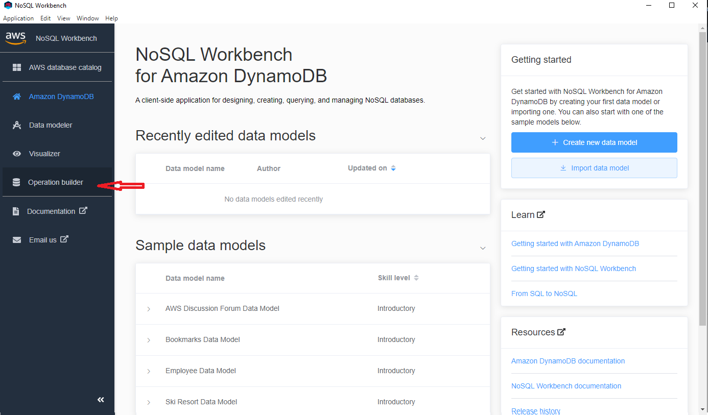

# Getting started with SAM

In order to be able to test AWS resources locally, one has to first install the Command Line Interface for AWS Serverless Application Model [AWS SAM CLI](https://docs.aws.amazon.com/serverless-application-model/latest/developerguide/sam-specification.html 'SAM Docs'). This is done in the shell through the following commands with _sudo_ privileges:

```
cd ~
wget "https://github.com/aws/aws-sam-cli/releases/latest/download/aws-sam-cli-linux-x86_64.zip"
unzip aws-sam-cli-linux-x86_64.zip -d sam-installation
sudo ./sam-installation/install
```

If unzip is not installed, please install it via `sudo apt-get install unzip `.

## Set AWS Credentials and Config

When the installation has been successful, be sure that the environment variables for the AWS CLI are set,. This can be done according to this [guide](https://docs.aws.amazon.com/serverless-application-model/latest/developerguide/serverless-getting-started-set-up-credentials.html 'AWS SAM config credentials'). On **Linux** and **MacOS**, create two files `credentials` and `config` in the path `~/.aws` (`~` refers to the "HOME" path, i.e., `/home/username`). You can do it by:

```
cd
mkdir .aws
cd .aws/
touch credentials
touch config
code .
```

### Credential file

You must populate the file `~/.aws/credentials` using the following pattern:

```
[default]
  aws_access_key_id=your_access_key_id
  aws_secret_access_key=your_secret_access_key
```

### Config file

You must populate the file `~/.aws/config` according to:

```
[default]
  region=us-east-1
  output=json
```

Alternatively (**NOT** suggested), one can simply export the environment variables recalling that everytime we exit the shell, they must be entered again.

```
export AWS_ACCESS_KEY_ID=your_access_key_id
export AWS_SECRET_ACCESS_KEY=your_secret_access_key
export AWS_DEFAULT_REGION=us-east-1
```

### Make sure everything works

In order to check everything is installed properly, simply run:

```
sam --version
```

That should return something that looks like `SAM CLI, version 1.55.0`.

# Getting started with NoSQL Workbench

Go to this [link](https://docs.aws.amazon.com/amazondynamodb/latest/developerguide/workbench.settingup.html) and download the installer for your OS of your **host** machine. Now, according to your OS:

- if you are using **Windows WSL**, you must download the installer for Windows.
- If you are on **Linux** you will download a .AppImage file, to run this make it executable (`chmod + x the_downloaded_file.AppImage`) and simply run it (`./the_downloaded_file.AppImage`), this will open the program with no installation required.
  After the download, proceed with the installation and open the program.

Now, click the `Launch` button next to the _DynamoDB_.


Click on `Operation builder` in the sidebar.


Now click on `Add Connection` button on top, next to Operation builder.


Fill the Connection Name with a memorable name, select your **Default AWS Region**, fill the input fields with your **access key IDs** and your **secret access key**, finally remember to persist the connection.


Congratulations! You should now be able to see the connection you have just created. By opening it, one can access all the Tables that have been created by the account being used.

# Getting started with DBeaver

This is actually not needed anymore, since only DBeaver Enterprise Edition (which is PAID) can support connection to DynamoDB resources.

~~[Dbeaver](https://dbeaver.io/ 'Dbeaver site') is a free multi-platform database that allows to handle multiple databases. In our case, it will be used to remotely access DynamoDB Tables that are in the cloud. The first step is to download and install DBeaver through the [download page](https://dbeaver.io/download/ 'Dbeaver download') on the host machine. This means that Windows users, that make use of WSL to program, can install DBeaver directly on Windows.~~
